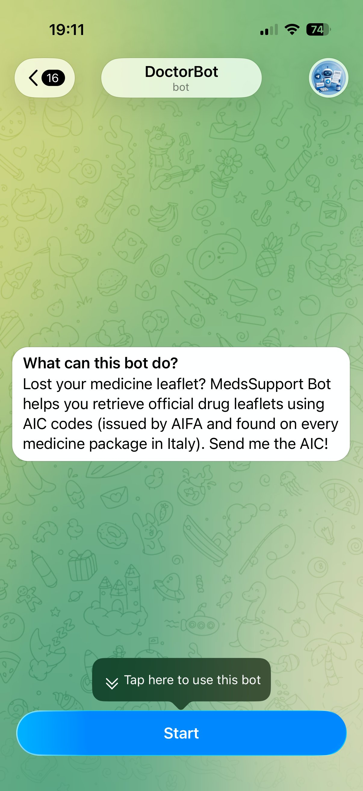
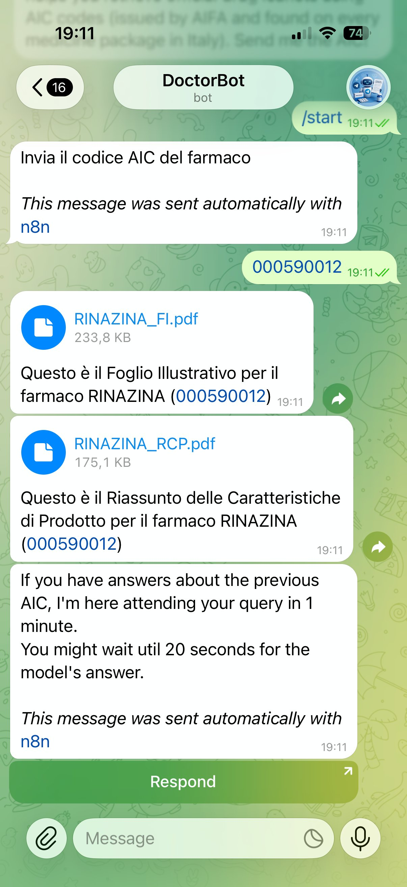
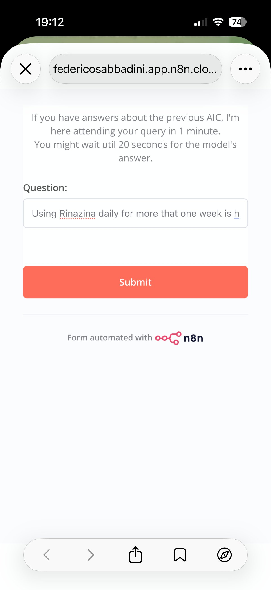
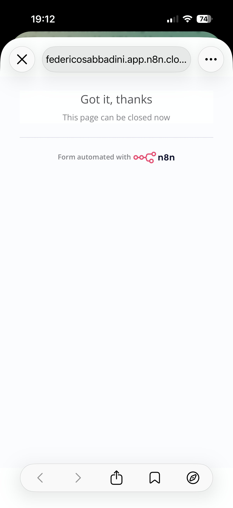
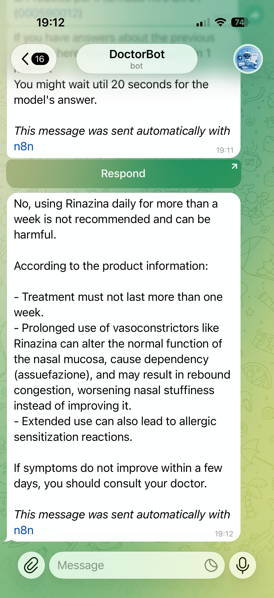

# Medical Support Bot

A RAG-based REST API that answers questions about Italian pharmaceutical products. Given a drug's AIC code, it retrieves the official product documentation (illustrative sheet and product features) from a NocoDB database, then uses Claude to answer user questions strictly within that context.

## Screenshots

The bot is deployed as a Telegram bot, orchestrated via **n8n**. Here is a full interaction from start to answer:

| Step | Screenshot |
|------|------------|
| 1. Bot introduction — user is prompted to send an AIC code |  |
| 2. AIC submitted → bot returns both official PDFs (Foglio Illustrativo + RCP) and asks for a question |  |
| 3. User types a question in the n8n-hosted form |  |
| 4. n8n confirms the submission |  |
| 5. Claude answers based strictly on the official documentation |  |

## How it works

1. A client sends a `GET` request with a `question` and an `AIC` code (Italian drug authorization number).
2. The loader queries a NocoDB database to find the matching drug record and its two associated PDF URLs.
3. Both PDFs are fetched and their text is extracted.
4. The extracted text is passed as context to Claude (`claude-opus-4-6` via LangChain), which answers the question exclusively based on that content.
5. The answer is returned as JSON.

```
User (Telegram) → n8n workflow → GET /?question=...&AIC=... → FastAPI Server → NocoDB → PDFs → Claude → n8n → Telegram reply
```

## Project structure

```
.
├── main.py              # Entry point: loads env vars, wires Model and Server
└── src/
    ├── server.py        # FastAPI app and route definitions
    ├── model.py         # Orchestrates Loader + LLMmodel
    ├── loader.py        # Fetches drug metadata from NocoDB and extracts PDF text
    └── llm.py           # LangChain wrapper around Claude
```

## Requirements

- Python 3.10+
- A [NocoDB](https://nocodb.com/) instance with a table containing drug records. Each row must have the following fields:
  - `Title` — drug name
  - `AIC` — authorization code
  - `URL1` — publicly accessible PDF URL (illustrative sheet)
  - `URL2` — publicly accessible PDF URL (product features)
- An [Anthropic API key](https://console.anthropic.com/)

## Setup

### 1. Clone the repository

```bash
git clone https://github.com/your-username/medical-support-bot.git
cd medical-support-bot
```

### 2. Install dependencies

```bash
pip install -r requirements.txt
```

### 3. Configure environment variables

Create a `.env` file in the project root:

```env
ANTHROPIC_API_KEY=your_anthropic_api_key
DB_URL=https://your-nocodb-instance/api/v1/db/data/noco/.../views/...
DB_KEY=your_nocodb_xc_token
```

### 4. Run the server

```bash
python main.py
```

The API will be available at `http://0.0.0.0:8000`.

## API

### `GET /`

Answer a question about a specific drug.

| Parameter  | Type   | Description                          |
|------------|--------|--------------------------------------|
| `question` | string | The question to ask about the drug   |
| `AIC`      | string | The drug's AIC authorization code    |

**Example request:**

```
GET http://localhost:8000/?question=What are the contraindications?&AIC=026089211
```

**Example response:**

```json
{
  "response": "The contraindications listed in the product documentation are ..."
}
```

If the answer cannot be found in the official documentation, the model will say so rather than hallucinate.

## Notes

- The LLM is instructed to answer **only** from the provided PDF context. It will explicitly decline to answer if the information is not present.
- The server binds to `0.0.0.0:8000` by default. Use `server.run_local()` in `main.py` to restrict to `127.0.0.1` during development.
- PDF text extraction uses `pypdf`. Scanned PDFs without embedded text layers will return empty strings.
